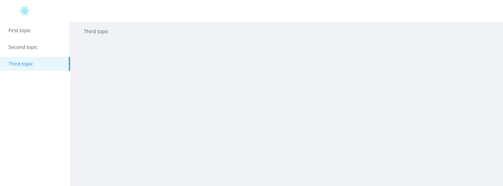

# ant-responsive-sidebar

This project demonstrates how to create a responsive sidebar with the Ant Design library.
Tech stack: React, Ant Design
To see a demo, head over to: http://c-likethis123.github.io/ant-responsive-sidebar

## Development

To run the project locally:

1. Clone this repository
2. `yarn install` to install dependencies
3. `yarn start` to start the project running on localhost

## Deployment

4. `yarn predeploy` or `yarn build` to build the project
5. `yarn deploy` to deploy the app to Github pages
